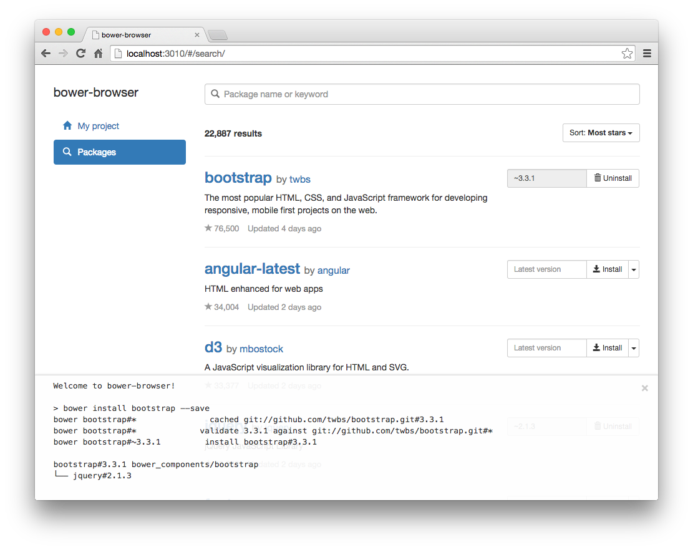
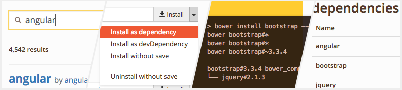

# bower-browser

> GUI Bower manager runs on web browser

[![NPM Version][npm-image]][npm-url]
[![Build Status][travis-image]][travis-url]
[![Dependency Status][deps-image]][deps-url]

[](resources/screenshot.png)

## Features
* Search from the Bower registry
* Install packages with various options
* Monitor log in realtime
* Manage local Bower components



## Installation
Install via npm.

```shell
$ npm install -g bower-browser
```

Install with `-g` option for command line interface, `--save` or `--save-dev` for using [module API](#api).  
[Grunt plugin](https://github.com/rakuten-frontend/grunt-bower-browser) is also available.

### Requirements
* [Node.js](https://nodejs.org/) or [io.js](https://iojs.org/)
* [Bower](http://bower.io/) and [Git](http://git-scm.com/)
* Modern web browser (IE10+ supported)

bower-browser executes `bower` in background.  
Make sure to install Bower if you haven't: `$ npm install -g bower`

## Usage
```shell
$ cd path/to/your-project
$ bower-browser
```

Then, web browser will open `http://localhost:3010` automatically.  
Manage your Bower components in the web GUI! :-)

### CLI Options
* `--path <directory>`  
  Location of bower.json. (default: use `process.cwd()`)

* `--port <number>`  
  Port number of bower-browser server. (default: `3010`)

* `--cache <seconds>`  
  Cache TTL for package list API. Set `0` to force to fetch API. (default: `86400` = 24hours)

* `--skip-open`  
  Prevent opening web browser at the start.

* `--silent`  
  Print nothing to stdout.

* `-h`, `--help`  
  Output usage information.

* `-V`, `--version`  
  Output the version number.

## Integration with Build Systems

### Gulp
Use `bower-browser` module directly.

```javascript
var bowerBrowser = require('bower-browser');

gulp.task('bower-browser', function () {
  bowerBrowser({
    // Options here.
  });
});

// Alias for running preview server and bower-browser at the same time.
gulp.task('serve', ['connect', 'bower-browser', 'watch'], function () {
  // ...
});
```

### Grunt
Use [grunt-bower-browser](https://github.com/rakuten-frontend/grunt-bower-browser) plugin.

## API

### Quick Start
```javascript
// Run bower-browser using default config.
require('bower-browser')();
```

### Advanced
```javascript
var bowerBrowser = require('bower-browser');

// Start app with options you like.
var app = bowerBrowser({
  path: 'path/to/project',  // Location of bower.json. default: null (use process.cwd())
  port: 8080,               // Port number. default: 3010
  cache: 0,                 // Cache TTL. Set 0 to force to fetch API. default: 86400 (24hrs)
  open: false,              // Prevent opening browser. default: true (open automatically)
  silent: true              // Print nothing to stdout. default: false
});

// Events
app.on('start', function () {
  console.log('Started bower-browser!');
});

// Methods
app.close();
```

**NOTE: Events and methods are experimental for now. They might be updated.**

#### Events
* `on('start', callback)`  
  When the web server is started.

* `on('close', callback)`  
  When the web server and all wathers are closed.

* `on('log', callback(message))`  
  When log message is received from bower execution.

#### Methods
* `close()`  
  Close web server and all watchers.

## License
Copyright (c) 2014-2015 Rakuten, Inc. Licensed under the [MIT License](LICENSE).

[npm-image]: https://img.shields.io/npm/v/bower-browser.svg?style=flat
[npm-url]: https://www.npmjs.com/package/bower-browser
[travis-image]: https://img.shields.io/travis/rakuten-frontend/bower-browser/master.svg?style=flat
[travis-url]: https://travis-ci.org/rakuten-frontend/bower-browser
[deps-image]: http://img.shields.io/david/rakuten-frontend/bower-browser.svg?style=flat
[deps-url]: https://david-dm.org/rakuten-frontend/bower-browser
